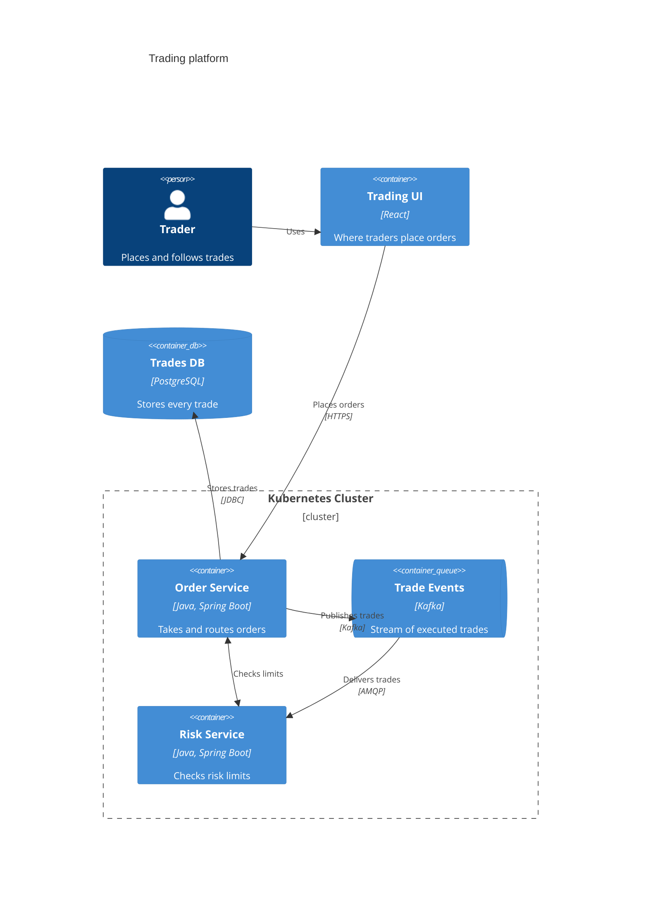

# Trading platform

The same system as `trading.drawio`, written as a Mermaid C4 container diagram.

```mermaid
C4Container
    title Trading platform

    Person(trader, "Trader", "Places and follows trades")
    Container(ui, "Trading UI", "React", "Where traders place orders")
    Boundary(k8s, "Kubernetes Cluster", "cluster") {
        Container(order, "Order Service", "Java, Spring Boot", "Takes and routes orders")
        ContainerQueue(events, "Trade Events", "Kafka", "Stream of executed trades")
        Container(risk, "Risk Service", "Java, Spring Boot", "Checks risk limits")
    }
    ContainerDb(db, "Trades DB", "PostgreSQL", "Stores every trade")

    Rel(trader, ui, "Uses")
    Rel(ui, order, "Places orders", "HTTPS")
    Rel(order, db, "Stores trades", "JDBC")
    Rel(order, events, "Publishes trades", "Kafka")
    Rel(events, risk, "Delivers trades", "AMQP")
    BiRel(order, risk, "Checks limits")
```
